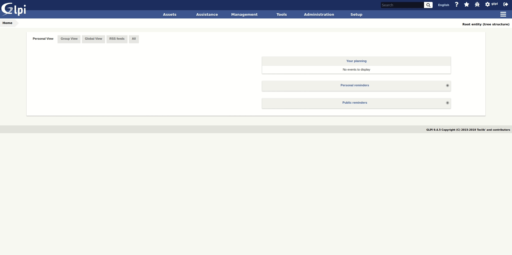

# Datainjection GLPI plugin

Add automatic action for data injection

All customizations are signed by comments
// WP
// START

// END

The plugin registers two automatic actions:

How-To:
- Define a datainject import model
- Configure one of the provided two automatic actions according this structure:

Within Comments field define:
<datainject_model_name>;<full_path_to_csv_file>;<integer of key column. Starts from 0>
Windows_Servers_model;/var/log/glpi/extras/glpi_import/Computers.csv;0

Starting version:
git remote add glpi_plugin_datainjection_orig https://github.com/pluginsGLPI/datainjection.git
TAG 2.4.1

### How do I get set up? ###

## English

This plugin allows data import into [GLPI](http://glpi-project.org) using CSV files.

It allows to create models of injection for a future re-use. It's been created in order to:

- import data coming from others asset management softwares
- inject electronic delivery forms

Data to be imported using the plugins are:

- inventory data (except softwares and licenses),
- management data (contract, contact, supplier),
- configuration data (user, group, entity).

## Documentation

We maintain a detailed documentation here -> [Documentation](https://glpi-plugins.readthedocs.io/en/latest/datainjection/index.html)

## Contact

For notices about major changes and general discussion of datainjection, subscribe to the [/r/glpi](https://www.reddit.com/r/glpi/) subreddit.
You can also chat with us via IRC in [#glpi on freenode](http://webchat.freenode.net/?channels=glpi) or [@glpi on Telegram](https://t.me/glpien).

## Professional Services

The GLPI Network services are available through our [Partner's Network](http://www.teclib-edition.com/en/partners/). We provide special training, bug fixes with editor subscription, contributions for new features, and more.

Obtain a personalized service experience, associated with benefits and opportunities.

## Contributing

* Open a ticket for each bug/feature so it can be discussed
* Follow [development guidelines](http://glpi-developer-documentation.readthedocs.io/en/latest/plugins/index.html)
* Refer to [GitFlow](http://git-flow.readthedocs.io/) process for branching
* Work on a new branch on your own fork
* Open a PR that will be reviewed by a developer

## Copying

* **Code**: you can redistribute it and/or modify
    it under the terms of the GNU General Public License ([GPL-2.0](https://www.gnu.org/licenses/gpl-2.0.en.html)).
